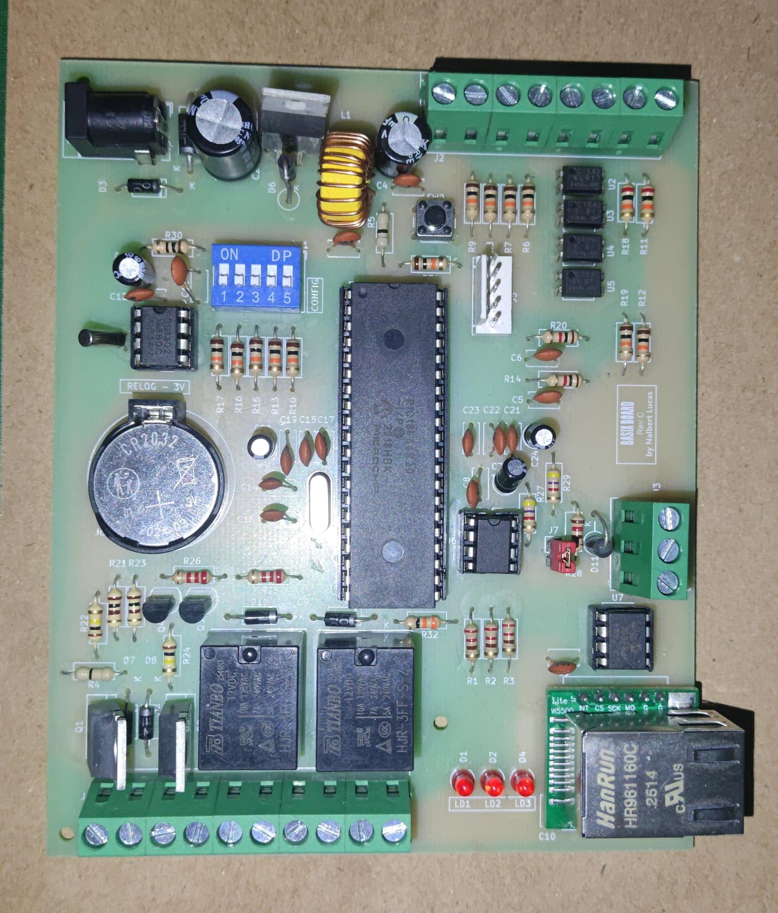

# BASIX Board

Open hardware embedded I/O controller for automation and IoT projects.

## Overview

BASIX is an open hardware embedded controller built primarily with through-hole (THT) components and based on the PIC18F46K20 microcontroller, providing Ethernet, RS485 and other peripherals.

It was designed as an educational platform for learning embedded electronics, prototyping automation systems, and experimenting with industrial communication interfaces and isolated I/O.

The complete hardware design is publicly available, including schematics, PCB layouts, manufacturing files, and documentation.

## Features

- 12VDC power input
- PIC18F46K20 microcontroller (16 MHz)
- Ethernet interface (W5500)
- RS-485 interface
- Real-Time Clock (RTC) with backup battery
- External 128 KB SPI EEPROM
- 4× optically isolated digital inputs
- 2× analog inputs (0–10 V)
- 2× relay outputs
- 2× digital/PWM outputs
- 5-position DIP switch for configuration
- 3x General purpose LEDs (feedback, status, etc)
- ICSP programming header

## Fabrication / Assembly

BASIX was designed with simplicity and accessibility in mind. The board uses mostly through-hole (THT) components, allowing it to be assembled using a standard soldering iron without requiring specialized equipment such as a reflow oven or hot-air station.

The PCB can be manufactured by any standard PCB fabrication service using the Gerber files available in the `hardware/gerbers` directory.

This approach makes the project suitable for hobbyists, students, makers, and anyone interested in learning embedded hardware design or building their own automation controller.

## Repository Structure

| Directory | Description |
|---|---|
| `hardware/kicad/` | Editable KiCad project files, including schematics, PCB layout, symbols, and footprints. |
| `hardware/gerbers/` | Gerber and drill files ready for PCB manufacturing. |
| `hardware/bom/` | Bill of Materials (BOM), including component references, quantities, and part numbers. |
| `docs/` | Technical documentation, hardware architecture, schematics, design notes, and revision history. |
| `images/` | Board photographs, KiCad 3D renders, diagrams, and images used throughout the documentation. |

## Documentation

Additional documentation can be found in the `docs` directory.

Topics include:

- Hardware architecture
- Design decisions
- Revision history

## Expansion Modules

BASIX was designed to be easily expanded through its RS-485 interface.

Developers, students, and makers are encouraged to design and share their own expansion modules, such as:

- Remote digital I/O
- Analog input/output modules
- Relay expansion boards
- Environmental sensors
- Energy monitoring
- LCD/HMI interfaces
- Motor controllers
- Industrial protocol gateways

The goal is to build an open ecosystem of interoperable modules that can communicate with BASIX using a simple RS-485 network.

If you develop an expansion board, feel free to share your project with the community by opening a Pull Request or creating your own repository referencing BASIX.

## Project Status

**Current release**

- Hardware Revision C
- Prototype validated

**Planned**

- Open-source firmware
- Desktop application (Lazarus) for monitoring and controlling I/O

## License

This project is licensed under the CERN Open Hardware Licence Version 2 - Weakly Reciprocal (CERN-OHL-W v2).

See the `LICENSE` file for details.
